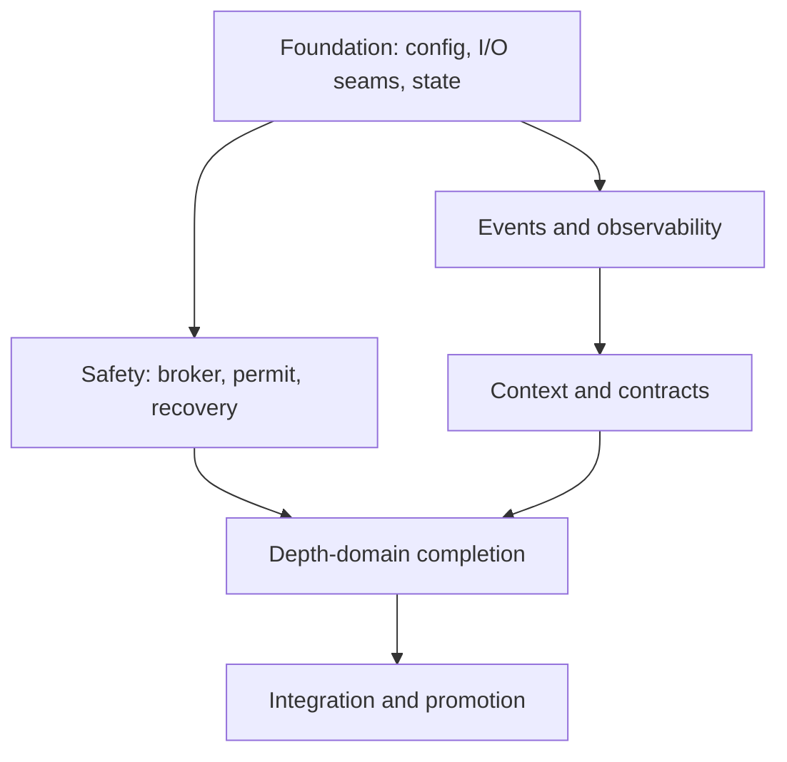

# Optid Capability Completion — Evidence-Backed Execution Plan

**Audit baseline:** `b509c629ae47cf75863c9a49a72c168c61289bb7`

**Date:** 2026-07-22

**Status:** Proposed; implementation packages are mergeable, but hardware-dependent capability claims remain evidence-gated.

## 0. How to use this plan

This is a build plan, not a claim that the research briefs are accepted product specifications. Repository authority descends from human direction through `AGENTS.md`, the north-star specification, accepted decision records, strategy, validated research, unfinished research, plans, milestones, evidence, and code (`AGENTS.md:39-60`). Research prototypes must remain experimental and disabled by default (`AGENTS.md:161-162`). Missing hardware evidence blocks only the dependent write or release claim; it does not block read-only work, simulation, dry-run behavior, or an off-by-default prototype (`AGENTS.md:173-188`; `docs/project-workflow.md:69-79`).

The original “30% implemented / 70% missing” estimate is not reproducible and is removed. Completion is tracked below by capability and promotion state:

- **landed:** code exists and is reachable;
- **incomplete:** code exists but its safety, deployment, restoration, or integration path is unfinished;
- **specified:** an accepted source defines enough behavior to implement;
- **spec-blocked:** research exists, but an accepted interface or product decision does not;
- **evidence-gated:** code may merge disabled, but actuation or a milestone claim requires evidence.

No worker may silently turn a research hypothesis into a product default.

## 1. Where optid is now

### 1.1 Capability truth table

| Domain | Repository truth at the audit baseline | State |
|---|---|---|
| CPU policy | EPP, platform profile, CPU DMA latency, sysctls, and mode decisions are represented and actuated (`crates/optid/src/action.rs:8-40`; `crates/optid/src/actuator.rs:372-621`; `crates/optid/src/policy.rs:545-720`). | Landed; retain and regression-test. |
| Runtime PM | Device discovery is in the snapshot, policy emits actions, and the actuator validates, journals, writes, and rolls back (`crates/optid/src/sensors.rs:31-60`; `crates/optid/src/policy.rs:721-745`; `crates/optid/src/actuator.rs:622-804`). Research 0009 also records the initial implementation as landed (`docs/research/0009-runtime-pm-autosuspend-policy.md:356-370`). | Incomplete, not a stub. |
| PCIe ASPM and SATA ALPM | Action variants, policy emission, allowlist checks, journaling, writes, and rollback exist (`crates/optid/src/action.rs:41-76`; `crates/optid/src/policy.rs:746-774`; `crates/optid/src/actuator.rs:805-938`). Research 0008 records this subset as landed (`docs/research/0008-nvme-apst-pcie-aspm-sata-alpm.md:318-334`). | Incomplete; NVMe APST and latency provenance are missing. |
| Backlight | A backlight is selected, policy emits a target, and the actuator clamps, journals, writes, and rolls back (`crates/optid/src/sensors.rs:123-207`; `crates/optid/src/policy.rs:756-774`; `crates/optid/src/actuator.rs:939-1013`). Research 0007 records this subset as landed (`docs/research/0007-display-panel-backlight-psr-vrr-dpms.md:427-438`). | Incomplete; ownership and display bridge are missing. |
| Hardware authorization | Unverified allowlist rows cannot authorize automatic writes (`crates/optid/data/allowlist.toml:23-26`; `crates/optid/src/allowlist.rs:342-363`). Every seed row is currently `verified = false` (`crates/optid/data/allowlist.toml:30-192`). | Safety mechanism landed; no seeded hardware is promoted for automatic depth writes. |
| Contracts | Class floors and `fits_contract()` exist, but the fit function is not called by the actuator (`crates/optid/src/contracts.rs:179-192`). The shipped contract comments incorrectly say device actuation is not implemented (`config/optid/contracts.toml:5-15`). | Incomplete and semantically underspecified. |
| Apply deployment | Dynamic device actions intentionally report no fixed `ReadWritePaths` capability (`crates/optid/src/capability.rs:119-145`), while the hardened service grants only fixed paths (`packaging/systemd/optid-apply.service:38-46`). | Blocking defect: landed dynamic-device writes cannot work reliably in the shipped apply service. |
| Restoration | The journal reverts on normal shutdown (`crates/optid/src/main.rs:402-407`), but policy only emits depth actions for battery idle and emits no inverse action on the next interactive or AC transition (`crates/optid/src/policy.rs:721-774`). | Blocking defect: desired state can persist until process shutdown. |
| Control loop | Policy and contracts are reloaded inside a two-second polling loop (`crates/optid/src/main.rs:321-400`). PSI is read from `/proc/pressure/*` (`crates/optid/src/sensors.rs:23-27`; `crates/optid/src/sensors.rs:93-110`). | Landed polling classifier; event reactor and atomic reload are missing. |
| Foreground/context | The foreground producer sleeps indefinitely (`crates/optid/src/foreground/mod.rs:69-99`); the receiver is retained but never consumed (`crates/optid/src/main.rs:303-319`); snapshots report no foreground app (`crates/optid/src/sensors.rs:74-76`). | Stub. |
| GameMode | The shim writes PID pin files, but classification consults them only when `foreground_app` is present (`crates/optid/src/main.rs:323-327`), which the snapshot never supplies (`crates/optid/src/sensors.rs:74-76`). | API surface exists; effect path is disconnected. |
| PPD and privileged D-Bus | PPD/GameMode services are started (`crates/optid/src/main.rs:218-235`). `PinApplication` is disabled pending authorization, while `SetMode` has no equivalent polkit check (`crates/optid/src/dbus.rs:90-108`; `crates/optid/src/dbus.rs:122-127`). The governing authorization ADR is still proposed (`docs/decisions/0009-optid-security-boundary.md:1-5`). | Security decision and implementation incomplete. |
| Runtime observability | Wakeup, runtime-PM, C-state, and PM QoS sources have research designs (`docs/research/0018-telemetry-runtime-state-observability.md:109-265`), but no steady-state eBPF runtime is proposed (`docs/research/0018-telemetry-runtime-state-observability.md:395-403`). | Specified for read-only sysfs/procfs work. |
| `rush_telemetry` | The crate is excluded from the workspace and is explicitly described as non-compiling, with missing BPF generation/dependencies (`Cargo.toml:9-17`; `docs/decisions/0017-rush-telemetry-fate.md:8-18`). | Quarantined; do not integrate into optid as-is. |
| Thermal/powercap | The snapshot exposes a maximum temperature, but no thermal-budget or powercap domain exists (`crates/optid/src/sensors.rs:31-60`). Research defines read-only fan/thermal coupling and a RAPL PL1 outer loop (`docs/research/0013-thermal-fan-budget-coupling.md:199-222`; `docs/research/0012-dtpm-powercap-outer-loop.md:141-167`). | Research-defined; write path evidence-gated. |
| Memory | VM sysctl actions already exist (`crates/optid/src/policy.rs:649-678`). Research assigns zram creation to `zram-generator`, not optid, and treats MGLRU as startup/static (`docs/research/0015-zram-mglru-tuning-per-ram-tier.md:198-212`). | Partial; optid should audit zram, not resize it. |
| dGPU | No domain implementation exists. Research allows generic runtime PM, requires explicit D3cold state, and restricts MUX handling to recommendation unless an interface is explicitly allowed (`docs/research/0011-dgpu-runtime-pm-and-mux.md:198-215`). | Specified subset; MUX write spec-blocked. |
| `sched_ext` | The enabling ADR is proposed, not accepted (`docs/decisions/0015-sched-ext-default-on.md:1-19`). The north-star specification says no work package may start until WP-B1 evidence exists (`docs/SPEC-northstar.md:207-212`). | Blocked. No implementation package in this plan. |
| Render scaling and ALS | Research 0019 is WIP, says mainstream compositors do not expose the proposed control, and requires source review/prototyping before a work package (`docs/research/0019-gpu-upscaling-resolution-scaling-als.md:1-12`; `docs/research/0019-gpu-upscaling-resolution-scaling-als.md:106-118`; `docs/research/0019-gpu-upscaling-resolution-scaling-als.md:390-409`). | Feasibility work only. |

### 1.2 Research coverage, papers 0001–0020

| Paper | Proposal | Code/plan disposition |
|---|---|---|
| 0001 | Broad comparison of Apple and Linux power primitives. | Use as an inventory, not an ABI. CPU policy is partly landed; HFI, frequency invariance, devfreq/memory-controller states, S0ix, IRQ affinity, idle injection, ARM MPMM, and related ideas require narrower specifications before actuation (`docs/research/0001-apple-power-stack-analysis.md:1-12`). |
| 0002 | Architecture/readiness review. | Strategy input only; no direct work package without a higher-authority interface (`docs/research/0002-rush-linux-architecture-review.md:1-10`). |
| 0003 | Unified orchestrator, contracts, policy, and feedback loops. | Drives the state, contract, and controller architecture after reconciliation with mandatory SPEC gates (`docs/SPEC-northstar.md:81-93`). |
| 0004 | Benchmark telemetry fidelity and a wire format. | Keep benchmark telemetry separate; extract only stable, licensed parsers after ADR-0017 (`docs/research/0004-telemetry-fidelity-rca-and-architecture.md:218-273`; `docs/research/0004-telemetry-fidelity-rca-and-architecture.md:355-368`). |
| 0005 | Combine resource pull with focus. | Implement cgroup resource pull first, then a session focus bridge; a root daemon cannot be a normal Wayland client (`docs/research/0005-focus-vs-resource-pull.md:113-179`; `docs/research/0005-focus-vs-resource-pull.md:653-703`). |
| 0006 | Hardware allowlist and depth-write gates. | Core landed; complete promotion tooling, typed permits, and durable recovery (`docs/research/0006-hw-allowlist-db-design.md:468-470`). |
| 0007 | Backlight plus session display bridge for PSR/VRR/DPMS. | Backlight landed. Build ownership handling, then a bridge; do not add direct KMS control to the root daemon (`docs/research/0007-display-panel-backlight-psr-vrr-dpms.md:398-407`; `docs/research/0007-display-panel-backlight-psr-vrr-dpms.md:427-438`). |
| 0008 | NVMe APST, PCIe ASPM, SATA ALPM. | ASPM/ALPM subset landed. Add NVMe APST, measured latency/provenance, firmware gates, and transition restoration (`docs/research/0008-nvme-apst-pcie-aspm-sata-alpm.md:226-240`; `docs/research/0008-nvme-apst-pcie-aspm-sata-alpm.md:318-334`). |
| 0009 | Runtime PM autosuspend. | Initial actuator landed. Complete device-use predicates, hotplug, PM QoS, deployment, and restore (`docs/research/0009-runtime-pm-autosuspend-policy.md:356-370`). |
| 0010 | PPD and GameMode compatibility. | PPD surface mostly exists; repair the GameMode effect path and session/system-bus boundary (`docs/research/0010-ppd-gamemode-dbus-shim.md:259-280`). |
| 0011 | dGPU runtime PM and MUX. | Implement observe plus conservative runtime PM. Keep MUX as advice until an accepted vendor-interface specification exists (`docs/research/0011-dgpu-runtime-pm-and-mux.md:198-215`). |
| 0012 | Thermal-budget-driven DTPM/powercap PI outer loop. | Split discovery, pure controller simulation, and write promotion. Proposed gains are hypotheses, not defaults (`docs/research/0012-dtpm-powercap-outer-loop.md:185-215`). |
| 0013 | Thermal and fan budget coupling. | Implement sensors and linear derating. Fan control and ACPI override remain out (`docs/research/0013-thermal-fan-budget-coupling.md:199-222`). |
| 0014 | Per-class `sched_ext` selection. | Blocked by SPEC and proposed ADR; retain as a research/evidence item (`docs/SPEC-northstar.md:207-212`; `docs/decisions/0015-sched-ext-default-on.md:1-19`). |
| 0015 | zram/MGLRU policy by RAM tier. | Audit zram-generator configuration and expose state. Do not create or resize live zram from optid (`docs/research/0015-zram-mglru-tuning-per-ram-tier.md:198-212`). |
| 0016 | mkosi archive pinning. | Outside optid capability completion (`docs/research/0016-mkosi-ala-snapshot-pinning.md:1-8`). |
| 0017 | UKI signing and Secure Boot. | Outside optid capability completion (`docs/research/0017-uki-signing-secure-boot-enrollment.md:1-8`). |
| 0018 | Runtime-state observability. | Implement stable sysfs/procfs readers and event aggregation; no eBPF steady-state dependency (`docs/research/0018-telemetry-runtime-state-observability.md:298-326`; `docs/research/0018-telemetry-runtime-state-observability.md:395-403`). |
| 0019 | Render scaling, upscaling, ALS. | Feasibility and compositor prototype only. Production control remains spec-blocked (`docs/research/0019-gpu-upscaling-resolution-scaling-als.md:307-345`; `docs/research/0019-gpu-upscaling-resolution-scaling-als.md:390-409`). |
| 0020 | Third-pass technical-debt audit. | Use its privilege-boundary, typed-permit, shared-I/O, and license findings; re-check stale implementation claims against current code (`docs/research/0020-third-pass-tech-debt-audit.md:89-147`; `docs/research/0020-third-pass-tech-debt-audit.md:162-194`). |

### 1.3 Existing plans, roadmaps, and milestones

| Document | Claimed role/status | Relationship to this plan |
|---|---|---|
| `docs/plans/agent-work-plan-v1.md` | Explicitly superseded (`docs/plans/agent-work-plan-v1.md:1-2`). | Historical only. |
| `docs/plans/work-plan-v2.md` | Agent/human recovery and proof plan (`docs/plans/work-plan-v2.md:1-19`). | Keep its authority/evidence discipline; do not reuse stale implementation inventory. |
| `docs/plans/v0.5-minimal-installable-system-proposal.md` | Draft awaiting agreement (`docs/plans/v0.5-minimal-installable-system-proposal.md:1-9`). | Image/install scope, not optid completion. |
| `docs/plans/v0.6-hardware-aware-optid-proposal.md` | Draft awaiting agreement (`docs/plans/v0.6-hardware-aware-optid-proposal.md:1-5`). | Several phases landed; foreground and hardware evidence remain unfinished. |
| `docs/plans/corrected-path-forward-v0.6-to-v1.md` | Proposed release sequence and a claimed single hardware blocker (`docs/plans/corrected-path-forward-v0.6-to-v1.md:5-36`). | Hardware nomination blocks v0.6 claims, not disabled build work, under the higher-authority workflow rules. |
| `docs/plans/WP-B1E-evidence-workplan.md` | Evidence dataset work plan (`docs/plans/WP-B1E-evidence-workplan.md:1-17`). | Supplies evidence promotion gates; it is not a code prerequisite. |
| `docs/plans/phase0-host-bench-evidence-schema.md` | Draft evidence schema (`docs/plans/phase0-host-bench-evidence-schema.md:1-10`). | Use after build for validated promotion records. |
| `docs/plans/phase0-policy-fail-closed-design.md` | Draft fail-closed design (`docs/plans/phase0-policy-fail-closed-design.md:1-10`). | Its core behavior has landed through explicit policy load state (`crates/optid/src/load_state.rs:20-72`; `crates/optid/src/main.rs:111-174`). Update or close the draft instead of reimplementing it. |
| `docs/plans/livedev-transition-plan.md`, `docs/plans/livedev-workspace-enablement.md`, `docs/plans/livedev-progress.json`, `docs/editions/livedev.md` | LiveDev construction and progress artifacts (`docs/plans/livedev-transition-plan.md:1-26`; `docs/editions/livedev.md:1-29`). | Separate track; only reusable simulation/testOS interfaces belong here. |
| `docs/strategy/strategic-plan-v1.2.md`, `docs/strategy/COMPASS.md` | Product strategy (`docs/strategy/strategic-plan-v1.2.md:23-33`; `docs/strategy/COMPASS.md:1-13`). | Supplies direction, not implementation authority over accepted safety rules. |
| `docs/strategy/reference-hardware.md`, `docs/strategy/mixed-load-workload.md` | v0.6 hardware slots and validation workload (`docs/strategy/reference-hardware.md:42-58`; `docs/strategy/mixed-load-workload.md:12-24`). | Used after build to promote capabilities and claims. |
| `release/milestones.toml` | v0.6 is in progress; v0.7 is Editions; v0.8 is Benchmark Lab (`release/milestones.toml:143-208`). | Do not invent a new v0.8 “full-domain optid” milestone. Add package-level ledger entries or a later milestone only by owner decision. |

## 2. Target architecture

“Complete optid” means a safe orchestration platform, not that every research idea writes hardware on every machine.

1. Sensors produce versioned observations with value, source path, timestamp, support state, and provenance.
2. Context combines system pressure, per-cgroup resource pull, optional authenticated focus, GameMode registrations, power source, thermal headroom, and user mode.
3. Policy produces a complete **desired state** for every domain on every evaluation, including explicit restore/unchanged outcomes.
4. A reconciler diffs desired state against the last successfully applied state. Leaving a condition restores affected values immediately; shutdown recovery is only the final fallback.
5. A privileged broker accepts typed operations only after capability/path validation, contract fit, verified hardware authorization, explicit mutation mode, and durable pre-write journaling. Those are the mandatory gates in the north-star specification (`docs/SPEC-northstar.md:81-93`).
6. Each domain supports `off`, `observe`, and `actuate`. New domains default to `off` or `observe`; `actuate` does not bypass hard gates.
7. `optctl status` and `optctl explain` show the observation, selected contract, desired state, gate result, applied result, and restoration state without implying unsupported capability.
8. A deterministic fake filesystem, fake clock, fake event source, and recording actuator make every package testable without nominated hardware.

The user experience is predictable: optid can explain what it sees and would do on any supported system; it changes only verified hardware when explicitly in apply mode; it restores promptly when context changes; and a crash or reboot cannot strand an unrecorded tuning.

## 3. Why this order

The critical path is safety and state ownership, not a contract call inserted into existing match arms.



- Foundation packages can merge independently because they preserve existing behavior.
- Read-only sensors, PSI events, cgroup resource pull, and controller simulation can proceed before hardware nomination.
- Session focus backends can proceed after the bridge protocol is frozen.
- Existing depth actuators must not be expanded until the deployment boundary and restoration model are fixed.
- Thermal sensing can merge before powercap; a pure PI controller can merge before any powercap write.
- `sched_ext`, MUX writes, render scaling, and ALS actuation do not enter the critical path because their product interfaces are not accepted.

## 4. Execution packages

Every package below is one independently reviewable PR unless its “modularity” field explicitly permits a split. Estimated lines are net production plus tests, not time.

### F1 — Freeze capability states and domain configuration

**Starting condition.** Policy configuration has per-feature booleans and defaults, while new research domains have no consistent runtime state (`crates/optid/src/policy.rs:290-374`). New research prototypes must stay experimental and disabled (`AGENTS.md:161-162`).

**What to do.** Add `DomainMode { Off, Observe, Actuate }` and typed domain configuration in `policy.rs`; add strict unknown-key and invalid-combination validation; preserve existing behavior through an explicit migration mapping. Add an `EffectiveConfig` object consumed by policy and exposed to `optctl`. Compile-time Cargo features may gate optional dependencies only; they must not be the runtime safety switch.

**Desired end state.** Every domain has one runtime state. `Actuate` still requires `--apply`, a verified allowlist match, a fitting contract, and a journaled operation.

**Tests/pass.** Table-test every old/new config combination. Invalid modes fail closed in apply mode. Dry-run prints the effective state. Existing curated default decisions remain unchanged.

**Feature flag.** `[domains.<name>] mode = "off|observe|actuate"`; new domains default `off`, new sensor-only domains default `observe` only when reads are side-effect-free.

**Modularity.** Depends on nothing. Exposes `EffectiveConfig` and `DomainMode`. No hardware access. Other packages may build against it.

**Spec gaps.** Owner must approve the compatibility mapping for existing booleans. Recommended: accept old keys for one release with a warning; reject conflicting old/new keys.

**Scope/risk.** Medium, 6–10 files, 400–700 LOC. Risk tier 1.

### F2 — Introduce injectable kernel I/O, clock, and event boundaries

**Starting condition.** Sensors and actuators call filesystem and time facilities directly (`crates/optid/src/sensors.rs:93-207`; `crates/optid/src/actuator.rs:622-1013`). Existing tests rely on path redirection but not a complete event/clock seam (`crates/optid/src/tests.rs:1-40`).

**What to do.** Create `kernel_io.rs` with narrow `KernelRead`, `KernelWrite`, `Clock`, and `EventSource` traits. Implement production and in-memory versions. Move shared procfs/sysfs parsing behind these interfaces without behavior changes. Keep path canonicalization and permitted roots centralized.

**Desired end state.** Sensor, policy, reconciler, and broker tests can simulate values, failures, hotplug, time, and partial writes deterministically.

**Tests/pass.** Run the current optid test suite through production-compatible adapters; add fault-injection tests for missing, malformed, permission-denied, short-write, and disappearing paths.

**Feature flag.** None; mechanical infrastructure.

**Modularity.** Depends on F1 only for shared naming, but can be prepared in parallel. Exposes stable test seams.

**Spec gaps.** None. Do not redesign policy in this package.

**Scope/risk.** Large, 10–16 files, 800–1,300 LOC. Risk tier 1; require a no-behavior-change diff review.

### F3 — Version observations, decisions, and action outcomes

**Starting condition.** `Snapshot`, `Decision`, actions, skip reasons, and status surfaces are separate structures without a versioned cross-domain envelope (`crates/optid/src/sensors.rs:31-60`; `crates/optid/src/decision.rs:1-63`; `crates/optid/src/capability.rs:1-80`).

**What to do.** Define versioned `ObservationEnvelope`, `DesiredState`, `GateOutcome`, `ApplyOutcome`, and `RestoreOutcome`. Include timestamps, source/provenance, support status, reason codes, and correlation ID. Document forward-compatibility rules. Adapt status emission without changing decisions.

**Desired end state.** `optctl`, logs, tests, and future telemetry consume the same truthful state model.

**Tests/pass.** Golden JSON tests; unknown-field compatibility; unsupported and skipped are distinct from failed; no source path leaks outside the permitted diagnostic surface.

**Feature flag.** `[diagnostics] schema_version = 1`; version 1 is default after compatibility tests.

**Modularity.** Depends on F1. Exposes schemas used by all later packages.

**Spec gaps.** Owner decision: whether the JSON contract is public/stable in v0.6 or explicitly experimental. Recommend experimental until one release of compatibility testing.

**Scope/risk.** Medium, 8–12 files, 500–800 LOC. Risk tier 1.

### F4 — Reconcile complete desired state and restore on transitions

**Starting condition.** Depth actions are emitted only for battery idle (`crates/optid/src/policy.rs:721-774`); the main loop reverts only at shutdown (`crates/optid/src/main.rs:402-407`).

**What to do.** Create `reconciler.rs`. Make policy return a complete desired state per domain. Track baseline, desired, last attempted, and last confirmed applied values. On AC attach, workload-class change, user-mode change, config reload, device removal, or domain disable, generate an immediate restore. Coalesce identical writes and make retries bounded.

**Desired end state.** No setting remains active merely because policy stopped mentioning it. Restoration is visible and idempotent.

**Tests/pass.** State-machine tests cover idle→interactive, battery→AC, apply→dry-run, enabled→off, config reload, hot-unplug, failed write, process shutdown, and restart recovery. Each transition produces exactly the expected writes and outcomes.

**Feature flag.** `[control] reconciler = "v1"`; shadow mode first, then default after parity tests. No bypass flag after promotion.

**Modularity.** Depends on F2–F3. Existing actuators can be adapters. Blocks expansion of depth writes.

**Spec gaps.** Define ownership when another program changes a value after optid. Recommend “restore only if current value still equals optid’s last applied value”; otherwise relinquish ownership and report drift.

**Scope/risk.** Large, 10–15 files, 900–1,500 LOC. Risk tier 2; independent verification required.

### S1 — Ratify the privilege and authorization boundary

**Starting condition.** Dynamic writes cannot be represented by the current fixed systemd path list (`crates/optid/src/capability.rs:119-145`; `packaging/systemd/optid-apply.service:38-46`). D-Bus authorization is inconsistent and ADR-0009 is proposed (`crates/optid/src/dbus.rs:90-108`; `crates/optid/src/dbus.rs:122-127`; `docs/decisions/0009-optid-security-boundary.md:1-5`). Research recommends structural typed permits and a smaller privileged boundary (`docs/research/0020-third-pass-tech-debt-audit.md:107-137`).

**What to do.** Write and accept one ADR covering: policy daemon identity; privileged broker process; Unix-socket protocol; peer-credential checks; polkit scope; multi-seat/session trust; allowed path roots; operation vocabulary; rate limits; audit records; and failure behavior. Prototype only the protocol types and threat-model tests until accepted.

**Desired end state.** One accepted security boundary replaces ad hoc D-Bus and broad systemd-write assumptions.

**Tests/pass.** Threat table covers unprivileged local user, compromised session bridge, symlink/path traversal, stale PID, confused deputy, replay, hotplug path replacement, malformed request, and daemon crash.

**Feature flag.** None; decision package. Prototype protocol is compile-time `experimental-broker`, off by default.

**Modularity.** Depends on F2–F3. Read-only packages can proceed while this is decided. All new privileged actuation depends on acceptance.

**Spec gaps.** Project owner/security maintainer must choose the boundary. Recommendation: unprivileged policy daemon plus minimal root broker; reject granting the daemon broad recursive `/sys/devices` write access.

**Scope/risk.** Small design PR, 2–4 files, <300 LOC plus tests/prototype. Risk tier 3; human acceptance required.

### S2 — Enforce typed permits in a minimal actuation broker

**Starting condition.** Current action match arms perform checks inline (`crates/optid/src/actuator.rs:622-1013`), and service deployment cannot grant dynamic paths safely (`packaging/systemd/optid-apply.service:38-46`).

**What to do.** After S1 acceptance, create a broker crate or binary. A `Permit<DomainOperation>` may be constructed only after path/capability validation, contract evaluation, verified hardware authorization, explicit mutation mode, and successful pre-write journal append. The broker accepts an explicit operation enum, never arbitrary path/value pairs. Preserve current action result reasons.

**Desired end state.** The policy process cannot cause a write outside a reviewed operation; the root process does not classify workloads or parse arbitrary policy.

**Tests/pass.** Unix-socket integration tests prove peer rejection, path traversal rejection, operation/path mismatch rejection, allowlist denial, contract denial, dry-run denial, journal failure denial, replay idempotence, and successful mock writes. Packaging test proves apply service can reach the broker without broad sysfs grants.

**Feature flag.** `[safety] broker = "shadow|enforce"`; default `shadow` in dry-run, `enforce` required before any newly added domain may actuate.

**Modularity.** Depends on S1 and F2–F4. Migrate existing action families in separate adapter commits if needed.

**Spec gaps.** Exact broker process/package name is an owner choice. Recommend `optid-actuator` and a private `/run/optid/actuator.sock`.

**Scope/risk.** Large, 12–20 files, 1,200–2,000 LOC. Risk tier 3; separate builder and verifier; human merge only.

### S3 — Make recovery durable across crash and reboot

**Starting condition.** The current revert path runs on controlled shutdown (`crates/optid/src/main.rs:402-407`). Research 0006 requires a persistent journal, safe boot recovery, and watchdog behavior (`docs/research/0006-hw-allowlist-db-design.md:468-470`); powercap research repeats persistent recovery requirements (`docs/research/0012-dtpm-powercap-outer-loop.md:185-194`).

**What to do.** Move the authoritative journal to `/var/lib/optid` with atomic append/fsync/rename semantics. Add boot-time recovery before apply mode, systemd watchdog notification, and `ExecStopPost` recovery. Record device identity plus path and reject restoration if identity changed. Compact only confirmed-restored records.

**Desired end state.** Abrupt termination or reboot leaves either a durable restoration record or no write.

**Tests/pass.** Fault-inject every boundary: before journal, after journal/before write, after write/before confirm, partial journal, full disk, broker kill, daemon kill, reboot simulation, path reuse, and repeated recovery. Pass means safe denial or idempotent restore with an explicit outcome.

**Feature flag.** `[safety] durable_journal = true`; mandatory for broker enforce mode.

**Modularity.** Depends on S2’s operation identity but its storage engine can be built after F2. Blocks powercap and new depth actuation.

**Spec gaps.** Retention and privacy policy for the journal. Recommend store only operation/path/device IDs and values, mode `0600`, retain unresolved entries indefinitely and resolved entries seven days.

**Scope/risk.** Large, 8–14 files, 800–1,300 LOC. Risk tier 3; independent crash-path verification.

### C1 — Model contracts with measured latency and provenance

**Starting condition.** `fits_contract()` exists but is disconnected (`crates/optid/src/contracts.rs:179-192`). `pm_qos_resume_latency_us` is an OS constraint interface, not evidence of device exit latency. Research defers cached PCIe/NVMe latency and firmware gating (`docs/research/0008-nvme-apst-pcie-aspm-sata-alpm.md:226-240`; `docs/research/0008-nvme-apst-pcie-aspm-sata-alpm.md:331-334`).

**What to do.** Define `LatencyEstimate { value_us, source, confidence, measured_at, hardware_id, firmware_id }`, contract composition rules, and an `Unknown` result. Parse per-cgroup overrides into a contract book. `Unknown` must deny latency-sensitive depth actuation but may permit observation/dry-run. Remove stale contract comments.

**Desired end state.** Contract gates compare a requested responsiveness floor with a defensible state/device exit-latency estimate; no PM QoS control value is misused as a measurement.

**Tests/pass.** Unit tests for max composition, unknown provenance, stale firmware cache, per-cgroup override, multiple active contracts, boundary equality, and reason strings. Property tests prove that tightening a floor cannot authorize a deeper state.

**Feature flag.** `[contracts] mode = "observe|enforce"`; default `enforce` for apply. No `--no-contract-gate`. ADR-0025’s one-run hardware bypass remains the sole experimental escape (`docs/decisions/0025-risk-based-project-workflow.md:22-41`).

**Modularity.** Depends on F1 and F3. Exposes a pure `ContractEvaluator`; actual writes wait for S2.

**Spec gaps.** Owner/research decision: trusted latency sources and cache invalidation. Recommended v1: kernel-reported state latency plus allowlist evidence tied to HWID/firmware; unknown denies actuation.

**Scope/risk.** Medium, 6–10 files, 500–800 LOC. Risk tier 2.

### E1 — Replace the fixed sleep with a real event reactor

**Starting condition.** The daemon reloads and evaluates every two seconds (`crates/optid/src/main.rs:321-400`). PSI already exposes files read by optid (`crates/optid/src/sensors.rs:93-110`).

**What to do.** Add `reactor.rs` using PSI trigger file descriptors with `poll`/`epoll`, udev events for device changes, D-Bus/config channels, and a bounded timer fallback. Keep observation collection separate from wakeup sources. Coalesce bursts and guarantee a maximum reevaluation interval. Reload policy/contracts only on SIGHUP or file-change events using parse-then-atomic-swap.

**Desired end state.** Relevant pressure, context, power, config, and hotplug transitions trigger prompt reevaluation without a permanent two-second scan.

**Tests/pass.** Fake-event tests cover trigger arm/rearm, burst coalescing, starvation, descriptor failure, fallback timer, SIGHUP atomicity, invalid reload retention, and clean shutdown. Pass means no busy loop and bounded reevaluation.

**Feature flag.** `[control] reactor = "poll-v1|event-v1"`; start `event-v1` in shadow, promote after parity tests.

**Modularity.** Depends on F2. PSI parsers and hotplug sources can be separate commits behind one interface.

**Spec gaps.** Trigger thresholds per workload class are not accepted. Make them explicit experimental config; do not invent PI-to-EPP gains.

**Scope/risk.** Large, 8–14 files, 800–1,300 LOC. Risk tier 2.

### O1 — Add truthful runtime-state observability

**Starting condition.** Research specifies stable read sources for wakeup, runtime PM, C-states, and PM QoS (`docs/research/0018-telemetry-runtime-state-observability.md:109-265`). The research design uses bounded polling and does not require eBPF (`docs/research/0018-telemetry-runtime-state-observability.md:298-326`; `docs/research/0018-telemetry-runtime-state-observability.md:395-403`).

**What to do.** Add sensor modules for wakeup sources, per-device runtime status/time, CPU idle residency deltas, PM QoS constraints, storage states, and display/backlight state. Report unsupported, permission-denied, malformed, and stale separately. Use delta counters with wrap/reset handling.

**Desired end state.** `optctl status` explains whether an intended optimization actually reached the kernel/device state.

**Tests/pass.** Fixtures cover kernel layout variants, counter reset/wrap, disappearing devices, unsupported files, and permission errors. A mock full-state snapshot must be deterministic.

**Feature flag.** `[observability.runtime] mode = "off|observe"`, default `observe` where reads are available.

**Modularity.** Depends on F2–F3; independent of actuation and hardware evidence.

**Spec gaps.** Sampling budgets need a product limit. Recommend per-source minimum intervals from research 0018 and a global read budget surfaced in diagnostics.

**Scope/risk.** Large, 10–16 files, 900–1,500 LOC. Risk tier 1.

### O2 — Discover cgroup v2 scopes and compute resource pull

**Starting condition.** Foreground is absent and no optid code reads per-cgroup `cpu.stat`/PSI. Research says resource pull must remain primary and focus is a supplemental signal (`docs/research/0005-focus-vs-resource-pull.md:653-703`).

**What to do.** Add `context/cgroups.rs` to enumerate eligible cgroup v2 scopes, map PIDs safely, read CPU/IO/memory PSI and usage deltas, rank active scopes, expire vanished groups, and attach contracts. Avoid requiring delegation for read-only host-visible files; report inaccessible subtrees.

**Desired end state.** optid identifies the cgroup creating meaningful resource demand even without a compositor or desktop.

**Tests/pass.** Fixture trees cover reused PIDs, nested scopes, vanished groups, zero intervals, counter reset, inaccessible paths, multiple seats/users, and equal-rank tie-breaking. Pass means stable deterministic ranking and no process-name heuristic.

**Feature flag.** `[context.resource_pull] mode = "off|observe|select"`; default `observe`, promote `select` after classifier parity tests.

**Modularity.** Depends on F2–F3 and feeds C1/E1. Independent of the session focus bridge.

**Spec gaps.** Eligible scope policy and weighting are not accepted. Owner must choose system/user/service inclusion. Recommend observe all readable leaves, select only user application scopes in v1.

**Scope/risk.** Large, 8–12 files, 800–1,300 LOC. Risk tier 2.

### X1 — Define and secure the session-context bridge

**Starting condition.** A root daemon cannot directly act as the user’s ordinary Wayland client, and foreign-toplevel app IDs do not reliably provide PIDs (`docs/research/0005-focus-vs-resource-pull.md:113-179`). Research 0010 also places GameMode compatibility at a session bridge (`docs/research/0010-ppd-gamemode-dbus-shim.md:259-280`).

**What to do.** Specify a versioned bridge protocol for seat/session identity, focused app identity, optional PID/cgroup evidence, fullscreen, audio/video activity, GameMode registration, monotonic sequence, and expiry. Authenticate the peer using S1. Never accept a bridge-provided arbitrary cgroup path without server-side PID/cgroup validation.

**Desired end state.** Desktop context is optional, authenticated, per-seat, expiring, and combined with resource pull rather than trusted as sole truth.

**Tests/pass.** Protocol tests cover disconnect/reconnect, stale messages, spoofed UID/PID, PID reuse, multi-seat, compositor restart, missing PID, and downgrade/unknown versions.

**Feature flag.** `[context.session_bridge] mode = "off|observe|select"`; default `off` until S1 and one backend land.

**Modularity.** Depends on F3, O2, and accepted S1. Exposes a backend-neutral protocol so GNOME/KDE/wlroots work can proceed independently.

**Spec gaps.** Owner/security decision: supported session bus/system service topology and polkit policy. Recommendation: per-user bridge to root broker via authenticated Unix socket, not a root Wayland client.

**Scope/risk.** Medium design/core, 6–10 files, 500–900 LOC. Risk tier 3.

### X2 — Implement compositor backends and correct GameMode

**Starting condition.** The foreground producer is a sleep stub and its channel is unused (`crates/optid/src/foreground/mod.rs:69-99`; `crates/optid/src/main.rs:303-319`). GameMode pin files do not affect classification without a foreground app (`crates/optid/src/main.rs:323-327`).

**What to do.** Build separate session-side backends for GNOME/Mutter, KDE/KWin, and wlroots-family compositors against X1. Each backend emits only evidence it can prove. Wire GameMode registration directly to server-validated PID/cgroup context with expiry; do not require the focused-app field. Add optional PipeWire-derived audio/video activity only after a documented permission model.

**Desired end state.** Resource pull works everywhere; supported desktops add focus/fullscreen; GameMode has a real, bounded effect; unsupported compositors degrade cleanly.

**Tests/pass.** One backend per PR. Use fake compositor/session buses and protocol recordings. Tests cover app-id-only focus, PID-backed focus, two seats, bridge loss, GameMode register/unregister/client death, and no compositor. Pass means context expires and resource pull remains functional.

**Feature flag.** `[context.backends.<name>] enabled = false` until that backend passes integration tests; GameMode `[compat.gamemode] mode = "observe|select"`, default `observe` during migration.

**Modularity.** Depends on X1. GNOME, KDE, wlroots, and GameMode are independent PRs. No backend may modify the root protocol ad hoc.

**Spec gaps.** Exact compositor APIs and supported versions require backend design notes. A `/proc/<pid>/cgroup` fallback is valid only when a trusted PID exists; it is not a substitute for focus.

**Scope/risk.** Large aggregate, 4–8 files and 400–900 LOC per backend. Risk tier 2; session-security paths tier 3.

### D1 — Complete runtime PM as a reconciled domain

**Starting condition.** Runtime PM actuation already validates, journals, writes, and rolls back (`crates/optid/src/actuator.rs:622-804`), but dynamic service deployment is broken and device-use/transition coverage is incomplete (`crates/optid/src/capability.rs:119-145`; `packaging/systemd/optid-apply.service:38-46`).

**What to do.** Port existing operations through S2/F4. Add typed discovery by device class, active-use predicates for network/audio/camera/input/storage, PM QoS and wakeup constraints, per-device delay policy, hotplug handling, and explicit restore. Preserve CNVi/carrier safety. Record current runtime status from O1.

**Desired end state.** Eligible verified devices enter autosuspend only when their contract and live-use constraints permit, and restore promptly on demand or context change.

**Tests/pass.** Mock matrix covers every device class, active-use guard, unknown latency, unverified allowlist, hotplug, drift, write failure, broker denial, and restore. Hardware is required only to promote a HWID from observe to actuate.

**Feature flag.** `[domains.runtime_pm] mode`, default `observe`; `actuate` only with all SPEC gates.

**Modularity.** Depends on F4, S2–S3, C1, O1. Device-class predicates may be separate PRs.

**Spec gaps.** USB audio/video activity and network-idle definitions need accepted thresholds. Unknown denies actuation.

**Scope/risk.** Large, 10–16 files, 900–1,500 LOC. Risk tier 3 for write path.

### D2 — Complete storage depth control, including NVMe APST

**Starting condition.** PCIe ASPM and SATA ALPM writes exist (`crates/optid/src/actuator.rs:805-938`), but research defers NVMe APST, measured exit latency, and firmware gating (`docs/research/0008-nvme-apst-pcie-aspm-sata-alpm.md:226-240`; `docs/research/0008-nvme-apst-pcie-aspm-sata-alpm.md:331-334`).

**What to do.** Port ASPM/ALPM through the reconciler/broker. Add NVMe Identify/PSD parsing and APST table construction behind a narrow interface; cache latency evidence by controller/firmware; guard mounted rotational SATA devices and active links; restore original settings on transition. Decide whether NVMe access uses an internal ioctl library or stable structured `nvme-cli` output before coding.

**Desired end state.** Storage depth is selected from actual device states and contracts, never a guessed universal latency.

**Tests/pass.** Binary/JSON fixtures cover PSDs, no APST, malformed identify data, firmware change, HDD guard, CNVi exclusion, active IO, hotplug, rollback, and unknown latency. Loopback/block-mock tests run in CI; hardware promotes only a matching HWID/firmware.

**Feature flag.** Separate `[domains.storage.nvme_apst|pcie_aspm|sata_alpm] mode`; default `observe`.

**Modularity.** Depends on F4, S2–S3, C1, O1. NVMe, ASPM, and ALPM can be separate PRs sharing the storage model.

**Spec gaps.** Owner chooses NVMe interface. Recommend a Rust ioctl implementation with recorded fixtures; avoid parsing human text.

**Scope/risk.** Large, 12–20 files, 1,200–2,000 LOC. Risk tier 3.

### D3 — Finish backlight ownership and add the display bridge

**Starting condition.** Direct backlight writes exist (`crates/optid/src/actuator.rs:939-1013`). The implementation uses a universal floor, while research calls for an HWID/PWM-specific floor and a session bridge for PSR/VRR/DPMS (`crates/optid/src/actuators/display.rs:16-23`; `docs/research/0007-display-panel-backlight-psr-vrr-dpms.md:337-339`; `docs/research/0007-display-panel-backlight-psr-vrr-dpms.md:398-407`).

**What to do.** First resolve floor policy. Add ownership/drift handling so manual user brightness changes are never immediately fought. Port writes through F4/S2. Extend X1 with advisory PSR, VRR, DPMS, and ABM hints; implement compositor-specific bridge adapters. The root daemon must not perform direct KMS control.

**Desired end state.** Backlight changes are safe, reversible, and respectful of manual control. Display power hints are applied only through a supported session API and truthfully reported.

**Tests/pass.** Brightness tests cover min/max, PWM HWID, user drift, suspend/resume, AC transition, bridge loss, unsupported compositor, and restore ownership. Bridge tests use recorded compositor replies.

**Feature flag.** `[domains.display.backlight] mode`, default `observe`; each bridge hint has its own `off|observe|actuate`, default `off`.

**Modularity.** Backlight ownership depends on F4/S2/C1. Session bridge hints depend on X1 but not storage/runtime PM.

**Spec gaps.** Owner must accept per-HWID floor policy and manual-override timeout. Recommend no special floor unless verified hardware evidence supplies one.

**Scope/risk.** Large aggregate, 12–20 files, 1,100–1,800 LOC. Risk tier 3 for writes.

### D4 — Add conservative dGPU runtime PM; keep MUX advisory

**Starting condition.** No dGPU domain exists. Research permits generic runtime PM but requires explicit D3 state and says MUX writes need an explicitly allowed interface (`docs/research/0011-dgpu-runtime-pm-and-mux.md:198-215`).

**What to do.** Discover display-class PCI devices and driver bindings; observe runtime status, power/control, active clients, render nodes, display attachment, and D3hot/D3cold state. Reuse the runtime-PM domain to request autosuspend only when no display or render client is active. Expose MUX state/recommendation but implement no vendor write.

**Desired end state.** optid can explain dGPU power state and safely request generic runtime suspension on individually verified systems; MUX remains user/firmware controlled.

**Tests/pass.** Fixtures cover hybrid graphics, eGPU hotplug, display attached, render client active, driver unbound, D3hot vs D3cold, unsupported vendor files, restore, and path reuse.

**Feature flag.** `[domains.dgpu.runtime_pm] mode`, default `observe`; `[domains.dgpu.mux] mode = "off|observe"` only.

**Modularity.** Depends on D1 and O1. Observation can merge before write support.

**Spec gaps.** A reliable userspace “wake hold” and vendor MUX ABIs are unspecified. Do not guess paths or add a “generic fallback.”

**Scope/risk.** Medium, 8–12 files, 600–1,000 LOC. Risk tier 3 for actuation.

### D5 — Keep memory ownership with the correct component

**Starting condition.** optid already emits VM sysctl actions (`crates/optid/src/policy.rs:649-678`). Research assigns zram sizing to `zram-generator` and treats MGLRU as static/startup (`docs/research/0015-zram-mglru-tuning-per-ram-tier.md:198-212`).

**What to do.** Add read-only audit of zram devices, compression algorithm, swap priority, RAM tier, MGLRU state, and effective swappiness. Reconcile existing swappiness/sysctl behavior through F4/S2. If edition packaging later wants tiered zram, generate static configuration outside optid in a separate packaging plan.

**Desired end state.** optid explains memory policy and may adjust approved reversible sysctls; it never swapoffs/resizes live zram.

**Tests/pass.** Fixtures cover no zram, multiple swap devices, malformed meminfo, MGLRU unavailable, RAM-tier boundaries, and transition restore.

**Feature flag.** `[domains.memory] mode`, default `observe`; reversible sysctl actuation retains current safe default mapping.

**Modularity.** Depends on F4/O1; broker migration for writes depends on S2. No zram implementation dependency.

**Spec gaps.** Edition-level zram defaults belong to a packaging decision, outside this plan.

**Scope/risk.** Medium, 6–10 files, 400–700 LOC. Risk tier 2.

### T1 — Build thermal sensing and a pure budget model

**Starting condition.** Only a maximum temperature is sampled (`crates/optid/src/sensors.rs:31-60`). Research specifies per-zone sensing, read-only fan data, linear derating, and no fan/ACPI override (`docs/research/0013-thermal-fan-budget-coupling.md:199-222`).

**What to do.** Discover thermal zones and hwmon sensors by stable identity; normalize units; model missing/stale sensors; derive a pure `ThermalBudget` with configurable hysteresis and linear derating. Read fan RPM/status only. Emit the input and reason for every budget.

**Desired end state.** A deterministic thermal budget is available to policy and diagnostics without changing hardware.

**Tests/pass.** Fixtures cover sensor naming, duplicates, stale/missing readings, fan absence, threshold crossings, hysteresis, and multi-zone maximum/weighted policies. Property tests prove budget never increases as temperature rises within a curve.

**Feature flag.** `[thermal] mode = "off|observe"`, default `observe`; budget policy experimental until thresholds are accepted.

**Modularity.** Depends on F2–F3. Independent of S1/S2 and hardware nomination.

**Spec gaps.** Zone selection, weights, and thresholds require an accepted policy. Recommend conservative max-of-eligible-zones for v1, with no fan writes.

**Scope/risk.** Medium, 6–10 files, 500–900 LOC. Risk tier 1.

### T2 — Add powercap discovery and PI simulation

**Starting condition.** No powercap domain exists. Research couples thermal budget to RAPL PL1 and labels controller gains as hypotheses (`docs/research/0012-dtpm-powercap-outer-loop.md:141-167`; `docs/research/0012-dtpm-powercap-outer-loop.md:200-215`).

**What to do.** Discover powercap zones/constraints and energy counters read-only. Implement a pure PI controller with explicit sample time, saturation, anti-windup, slew limit, reset rules, and trace output. Replay recorded/synthetic thermal traces. Do not feed PSI into this PI and do not write PL1 in this package.

**Desired end state.** The controller can be reviewed and tuned from reproducible traces before privileged actuation exists.

**Tests/pass.** Step, ramp, noise, sensor loss, time jump, saturation, recovery, and overflow tests. Pass limits overshoot, oscillation, slew, and integral windup according to an accepted controller spec.

**Feature flag.** `[domains.powercap] mode = "off|observe|simulate"`, default `observe` when supported.

**Modularity.** Depends on T1/F2/F3. Independent of S2 for simulation.

**Spec gaps.** Accepted control objective, gains, sample period, bounds, and AMD backend are missing. Owner/control reviewer must accept them; do not use research hypotheses as defaults.

**Scope/risk.** Medium, 8–12 files, 600–1,000 LOC. Risk tier 2.

### T3 — Promote PL1 actuation behind all safety gates

**Starting condition.** T2 provides observation/simulation only. Research requires persistent recovery/watchdog for power limits (`docs/research/0012-dtpm-powercap-outer-loop.md:185-194`).

**What to do.** Add only the accepted v1 backend—recommended Intel RAPL PL1—to S2’s operation vocabulary. Clamp to hardware-reported bounds, journal the original constraint durably, rate-limit changes, restore on disable/transition/crash, and fail to firmware default on uncertain identity. AMD HSMP is a separate future package.

**Desired end state.** Verified hardware can opt into bounded PL1 control; every write is explainable and recoverable.

**Tests/pass.** Broker mocks cover bounds, unsupported constraints, write verification, drift, journal failure, watchdog failure, crash recovery, and controller reset. Real hardware evidence is required before adding an allowlist verification or changing default from observe.

**Feature flag.** `[domains.powercap] mode = "actuate"`, default never; requires `--apply` and all hard gates.

**Modularity.** Depends on S2–S3, C1, T1–T2. Does not block other domains.

**Spec gaps.** T2 controller decision and backend scope must be accepted first.

**Scope/risk.** Medium, 6–10 files, 500–900 LOC. Risk tier 3; independent verifier and hardware promotion evidence.

### R1 — Resolve telemetry ownership and extract stable parsers

**Starting condition.** `rush_telemetry` is excluded and non-compiling (`Cargo.toml:9-17`; `docs/decisions/0017-rush-telemetry-fate.md:8-18`). Research 0004 targets benchmark fidelity, while research 0018 rejects a steady-state eBPF dependency (`docs/research/0004-telemetry-fidelity-rca-and-architecture.md:242-273`; `docs/research/0018-telemetry-runtime-state-observability.md:395-403`).

**What to do.** Decide whether the crate is repaired as benchmark-only, replaced, or archived. Resolve licensing before code reuse. Extract only stable PSI/RAPL/HFI parsers needed by both benchmark and optid into a small workspace crate with tests; no BPF loader enters optid.

**Desired end state.** Runtime observability and benchmark telemetry share proven parsers without sharing lifecycle, privilege, or unverifiable eBPF claims.

**Tests/pass.** Workspace builds with default features; parser fixtures pass; license/deny checks pass; optid has no clang/libbpf runtime requirement.

**Feature flag.** Optional parser features by source (`rapl`, `hfi`); no `ebpf-telemetry` runtime flag.

**Modularity.** Decision can proceed after F2. O1 may implement local parsers and migrate later.

**Spec gaps.** ADR-0017 must be accepted or replaced by owner/legal maintainer.

**Scope/risk.** Medium, 5–10 files, 400–800 LOC if extraction is approved. Risk tier 2.

### R2 — Specify remaining platform primitives before implementation

**Starting condition.** Research 0001 inventories HFI, frequency invariance, devfreq/memory-controller P-states, LPMD/DPTF hints, S0ix, idle injection, IRQ affinity, ARM MPMM, and other primitives, but does not define one accepted optid interface for them (`docs/research/0001-apple-power-stack-analysis.md:1-12`).

**What to do.** Create one short design note per primitive covering user value, stable kernel ABI, ownership, read/write risk, contract interaction, fallback, feature state, tests, and evidence required. Merge read-only inventory only when the ABI is stable. Do not bundle unrelated writes.

**Desired end state.** Every paper-0001 capability is either mapped to an existing package, a bounded new package, or an explicit rejected/deferred decision.

**Tests/pass.** A design review checklist proves no arbitrary debugfs/vendor ABI, no duplicate kernel policy, and a mockable interface. Observation prototypes must emit unsupported truthfully.

**Feature flag.** Per primitive, `off|observe`; no `actuate` until an accepted decision and separate package.

**Modularity.** Independent research/design lane. Never blocks the core completion path.

**Spec gaps.** The interfaces themselves are the gaps. Kernel/power maintainer and owner resolve each separately.

**Scope/risk.** Small per note, 1–3 files, <300 LOC. Observation prototypes medium. Risk tier 1–2.

### R3 — Run feasibility gates for render scaling and ALS

**Starting condition.** Research 0019 is WIP, mainstream compositor support is absent, and its own next step is prototype/evidence before a work package (`docs/research/0019-gpu-upscaling-resolution-scaling-als.md:106-118`; `docs/research/0019-gpu-upscaling-resolution-scaling-als.md:390-409`).

**What to do.** Produce compositor-specific feasibility notes and an off-by-default session prototype only where a supported API exists. Evaluate ALS sensor sources, user ownership, calibration, privacy, and manual override. The referenced `laptop-auto-brightness` project must not be assumed to provide an IIO daemon; source review found a webcam/OpenCV/X11 application, so integration requires a new design.

**Desired end state.** A decision records supported compositor/API combinations and either authorizes a bounded production package or rejects/defer the feature.

**Tests/pass.** Prototype tests prove reversible session-only behavior, no root KMS writes, manual override, bridge loss recovery, and no camera activation without explicit consent.

**Feature flag.** Compile/runtime `experimental-render-scale` or `experimental-als`, both off by default and unavailable in apply policy.

**Modularity.** Independent feasibility lane; not on the critical path.

**Spec gaps.** Compositor APIs, scaling ownership, quality contract, ALS source, calibration, and privacy. Owner plus desktop maintainer decide after prototype evidence.

**Scope/risk.** Small design PR; prototype medium, 400–800 LOC. Risk tier 2.

### I1 — Make diagnostics and configuration friction-free

**Starting condition.** Capability/status structures exist, but they do not expose the complete observation→decision→gate→write→restore chain (`crates/optid/src/capability.rs:1-80`; `crates/optid/src/decision.rs:1-63`).

**What to do.** Extend `optctl status`, `explain`, and JSON output for effective config, domain mode, support, source/provenance, selected context/contract, desired value, gate reason, applied value, drift, pending restore, and last error. Add `--all-domains-off`, `--all-domains-observe`, and dry-run policy overlays that cannot enable mutation.

**Desired end state.** One diagnostic invocation explains all domains without requiring log archaeology or privileged writes.

**Tests/pass.** Golden CLI/JSON tests for supported, unsupported, off, observe, denied, applied, drifted, failed, and restored states. CLI never labels “configured” as “applied.”

**Feature flag.** None for truthful status; experimental fields remain versioned under F3.

**Modularity.** Depends on F1/F3 and can land incrementally per domain.

**Spec gaps.** Public JSON stability decision from F3.

**Scope/risk.** Medium, 6–10 files, 500–900 LOC. Risk tier 1.

### I2 — Build the full-system simulation and fault matrix

**Starting condition.** The repository has testOS and fixtures, but the current plan needs deterministic combinations without a hardware prerequisite (`AGENTS.md:173-188`; `docs/project-workflow.md:69-79`).

**What to do.** Create scenario fixtures for idle/interactive/latency/throughput, AC/battery, thermal rise/recovery, foreground/no foreground, GameMode, device hotplug, unsupported hardware, permission denial, malformed sysfs, config reload, broker crash, and reboot recovery. Run with all domains off, observe, individually actuating against mocks, and all supported mock actuators together.

**Desired end state.** Every package has isolated tests and the integrated daemon has a reproducible no-hardware acceptance suite.

**Tests/pass.** A matrix manifest declares expected observations, desired states, gate outcomes, writes, and restores. CI fails on undeclared write, stale desired state, or non-deterministic output.

**Feature flag.** `--simulation-root <fixture>` is test-only and refuses real writes; production `--dry-run` remains the user-facing no-write mode.

**Modularity.** Begins after F2–F4; each domain adds fixtures in its own PR. Does not replace hardware promotion evidence.

**Spec gaps.** None; expected outcomes are reviewed with each package.

**Scope/risk.** Large, 12–25 files, 1,000–2,000 LOC. Risk tier 1.

### I3 — Integrate and promote without turning hardware into a build gate

**Starting condition.** v0.6 is hardware-gated, while higher-authority workflow rules allow research, simulation, dry-run, and disabled prototypes to proceed (`release/milestones.toml:143-181`; `AGENTS.md:173-188`).

**What to do.** Merge in dependency order with new domains off/observe. For each hardware family, create a separate evidence PR that records HWID/firmware, fixture version, before/after state, responsiveness contract, rollback result, and allowlist promotion. Update milestone status only after its stated evidence passes. Never edit a false “done” claim merely because code merged.

**Desired end state.** Code construction proceeds without nominated machines; automatic writes and release claims remain evidence-backed.

**Tests/pass.** Every merge passes workspace format/build/clippy/tests plus I2. Every actuation promotion passes the domain’s hardware protocol and independent verification required by risk tier. Human merges remain mandatory (`docs/decisions/0025-risk-based-project-workflow.md:22-41`).

**Feature flag.** Promotion changes only a verified allowlist/evidence row or accepted default; no hidden environment bypass.

**Modularity.** Final integration lane. Hardware delays one promotion, not unrelated packages.

**Spec gaps.** Reference-machine nomination remains an owner decision for v0.6 claims (`docs/strategy/reference-hardware.md:49-58`).

**Scope/risk.** Small per promotion PR; risk tier follows the domain.

## 5. Dependency and parallelization map

| Lane | Sequential core | Safe parallel work |
|---|---|---|
| Foundation | F1 → F3 → F4 | F2 can start with F1. |
| Safety | S1 → S2 → S3 | S3 storage engine can prototype against F2 after S1 vocabulary freezes. |
| Events/context | F2 → E1; F2/F3 → O1/O2; O2 + S1 → X1 → X2 | O1, O2, T1, R1, R2, and R3 are independent read/design lanes. |
| Contracts | F1/F3 → C1 | Latency parsers/fixtures can proceed while source policy is decided. |
| Depth | F4 + S2/S3 + C1 + O1 → D1/D2/D3 | D1, D2, and D3 then run in parallel; D4 follows D1; D5 is mostly independent. |
| Thermal | T1 → T2 → T3 | T1/T2 proceed before broker/hardware; T3 waits for S2/S3/C1. |
| Integration | F3/F4 → I1/I2 → I3 | Each domain adds its own diagnostics and fixtures before merge. |

Critical path to safe new hardware writes: **F1/F2/F3 → F4 → S1 → S2 → S3 → C1 → selected domain → I2 → evidence promotion**.

`sched_ext` is not shown because SPEC forbids its work package until WP-B1 evidence (`docs/SPEC-northstar.md:207-212`). MUX writes and render/ALS production actuation are not shown because they require accepted designs.

## 6. Integration and testing strategy

### 6.1 Runtime mode matrix

| Global state | Domain `off` | Domain `observe` | Domain `actuate` |
|---|---|---|---|
| Normal dry-run | No reads beyond capability discovery | Read and explain | Read, compute, show denied-by-dry-run; never write |
| `--apply` absent | Same | Same | Denied by mutation gate |
| `--apply` present, gate fails | Same | Same | No write; exact contract/allowlist/journal/capability denial |
| `--apply` present, all gates pass | Same | Same | Broker writes, verifies, records, reconciles, and restores |

No per-domain flag may weaken the four mandatory gates (`docs/SPEC-northstar.md:81-93`).

### 6.2 Package acceptance

Every PR must pass:

1. format, workspace build, clippy, and tests under the repository toolchain;
2. package-specific unit/property/golden tests;
3. no-hardware fixture coverage for success, unsupported, malformed, permission-denied, disappearing path, and restore;
4. default-off/observe proof for new domains;
5. diagnostics proof for all outcomes;
6. documentation and config migration checks;
7. independent verification for risk-tier 3 or release/evidence claims.

Real hardware is not a prerequisite to merge a disabled implementation. It is mandatory to mark a HWID verified, enable automatic writes for that hardware, or claim the milestone behavior.

### 6.3 Worker-agent execution contract

Each worker receives a deterministic packet. This is required whether execution uses one agent, a team, or a swarm.

```text
Work package: <exact ID and title>
Base: <immutable commit SHA>
Authority sources: <exact files and line ranges>
Read before edit: <bounded file list>
Allowed paths: <exact paths or modules>
Forbidden changes: defaults, public schemas, safety gates, unrelated refactors
Inputs/interfaces: <types and versions consumed>
Outputs/interfaces: <types and versions produced>
Acceptance: <exact tests and expected observable outcomes>
Stop conditions: ambiguous ABI; missing source; safety/default change; dependency mismatch
Handoff: files changed; tests run/results; assumptions; unresolved gaps; risk tier
```

Execution rules:

- One package per branch and PR. Do not combine “nearby” packages.
- Rebase/refresh the immutable base before coding; if an interface changed, stop and request a new packet.
- Do not improvise kernel ABIs, vendor paths, controller gains, security policy, defaults, or milestone claims.
- A missing choice is a stop condition, not permission to choose a convenient value.
- Tests must assert behavior and outcomes; “builds” or “minimum passing tests” is not completion.
- The builder may self-verify risk-tier 1. Risk-tier 2 needs a cold review. Risk-tier 3 needs a separate verifier and human merge.
- Worker agents report facts only: exact commands, statuses, files, and remaining gaps. They never mark hardware verified from mocks.
- Parallel workers may depend only on frozen interfaces. The integration owner, not leaf workers, resolves cross-package conflicts.

### 6.4 Merge train

1. Merge F1–F3 and test seams.
2. Merge F4 in shadow/parity mode.
3. Accept S1, then merge S2/S3 with existing actuator adapters.
4. Merge E1/O1/O2/C1/T1/T2 and session protocol work.
5. Merge domain completions individually in observe/default-off mode.
6. Merge I1/I2 continuously, not as a late capstone.
7. Promote one hardware/domain combination per evidence PR through I3.

## 7. Out of scope

This plan does not build distro editions, mkosi profiles, archive pinning, UKI/Secure Boot enrollment, AUR submissions, installer work, release marketing, general user documentation, or edition packaging. Papers 0016 and 0017 are explicitly outside optid capability completion. Static zram-generator configuration belongs to edition/packaging work, not the optid runtime. Hardware benchmarking is a later promotion activity, not a prerequisite for disabled code construction.

## 8. Fit with the project roadmap

- The v0.6 hardware gate remains valid for v0.6 behavior claims (`release/milestones.toml:143-181`). This plan lets off/observe/simulation work proceed while that evidence is unavailable (`AGENTS.md:173-188`).
- `corrected-path-forward-v0.6-to-v1.md` remains the proposed release sequence, but its “single blocker” does not describe the code-build dependency graph (`docs/plans/corrected-path-forward-v0.6-to-v1.md:20-36`).
- The v0.6 proposal’s foreground phase is replaced by O2/X1/X2 because the current stub and privilege topology require a resource-pull core plus session bridge (`crates/optid/src/foreground/mod.rs:69-99`; `docs/research/0005-focus-vs-resource-pull.md:113-179`).
- `release/milestones.toml` keeps v0.7 as Editions and v0.8 as Benchmark Lab (`release/milestones.toml:183-208`). This plan does not rename or overload either milestone.
- Milestone ledgers should link completed package PRs as implementation evidence and separate hardware promotion PRs as capability evidence. Merging code never changes a milestone status by itself.

## 9. Blocking specifications and decisions

| Gap | Why it blocks | Resolver | Recommended resolution |
|---|---|---|---|
| Privilege broker and D-Bus/session authorization | Dynamic writes do not fit current service confinement; trust is inconsistent. | Owner + security maintainer | Accept S1: unprivileged policy, narrow root broker, authenticated per-user bridge. |
| Desired-state ownership and drift | Without it, optid can fight users or restore someone else’s value. | Owner + optid maintainer | Restore only values still equal to optid’s last confirmed write; otherwise relinquish and report drift. |
| Contract exit-latency sources | PM QoS constraint values are not measurements. | Kernel/power maintainer + owner | Kernel-reported state latency plus HWID/firmware evidence; unknown denies actuation. |
| NVMe APST control ABI | Text parsing and ioctl choices have different stability/testability. | Storage maintainer | Typed Rust ioctl with recorded Identify fixtures. |
| Backlight floor/manual override | Current universal 10% conflicts with research’s HWID-specific floor. | Owner + display maintainer | No special floor without verified PWM/HWID evidence; explicit manual-override ownership. |
| Session bridge protocol/backends | Wayland focus is compositor/session-specific and app-id may lack PID. | Desktop + security maintainers | Freeze X1, then one backend per PR; resource pull remains primary. |
| dGPU wake hold and MUX ABI | No safe generic vendor write exists. | GPU maintainer + owner | Generic runtime-PM observe/actuate only; MUX advice only until an accepted vendor spec. |
| Thermal policy and PI parameters | Research values are hypotheses. | Control reviewer + owner | Accept objective, sample time, gains, bounds, anti-windup, and promotion evidence before T3. |
| Telemetry crate ownership/license | Excluded, non-compiling code cannot become a runtime dependency. | Owner + legal/build maintainer | Accept/replace ADR-0017; keep eBPF out of optid steady state. |
| cgroup eligibility/weighting | Wrong scope selection harms foreground decisions. | Owner + desktop/systemd maintainer | Observe all readable leaves; select user application scopes first. |
| `sched_ext` | SPEC explicitly blocks the work package. | Owner through SPEC/ADR/evidence change | Gather WP-B1 evidence; accept or reject ADR-0015 before coding. |
| Render scaling/ALS | No accepted compositor API, quality contract, sensor ownership, or privacy model. | Desktop maintainer + owner | R3 feasibility only; no production package until an accepted design. |
| Remaining paper-0001 primitives | Broad ideas lack bounded ownership and ABI specifications. | Kernel/power maintainer | One design note and package per primitive; observation before actuation. |

These gaps do not block unrelated read-only, simulation, test-seam, or documentation packages. They block only the dependent interface or write path.

## 10. Audit record and limitations

### 10.1 Repository read record

The audit baseline contains 723 tracked paths. Every tracked Git object at `b509c629ae47cf75863c9a49a72c168c61289bb7` was read byte-for-byte from the object database. The exact path manifest is the output of:

```text
git ls-tree -r --name-only b509c629ae47cf75863c9a49a72c168c61289bb7
```

Eight objects are symbolic links and were read as link targets. Two tracked objects are ELF executables and could not be read as source:

- `mkosi/mkosi.extra/usr/bin/optctl` — **COULD NOT READ AS SOURCE: binary ELF; corresponding Rust source was read.**
- `mkosi/mkosi.extra/usr/libexec/optid` — **COULD NOT READ AS SOURCE: binary ELF; corresponding Rust source was read.**

All remaining tracked objects were text/data/source or link content and were read. The working tree’s eight broken systemd symlinks were not edited.

The explicitly referenced sibling repository `Nan0pk/laptop-auto-brightness` was separately source-read at commit `232fdaef...` because paper 0019 had not verified it. It is a webcam/OpenCV/X11 application with direct sysfs backlight writes, not an IIO ALS session daemon; therefore it is not treated as an implementation dependency.

### 10.2 GitHub API record

The audit did not use the token pasted into the prompt. Public REST and the installed GitHub connection were used.

| Call | Result |
|---|---|
| Repository metadata | HTTP 200 |
| Pull requests, all states | HTTP 200; API reported 273 records across three pages |
| Actions workflow runs | HTTP 200; API reported 4,171 total; first and last pages were sampled, not every run semantically audited |
| Contributors | HTTP 200; 11 records |
| Repository rulesets | HTTP 200; one ruleset named `protect-main` |
| Classic branch protection | HTTP 401: `Requires authentication` |
| Dependabot alerts | HTTP 401: `Requires authentication` |
| Code-scanning alerts | HTTP 401: `Requires authentication` |
| Secret-scanning alerts | HTTP 401: `Requires authentication` |
| PR #322 fetch through installed GitHub connection | Success |
| `OPTID-COMPLETION-PLAN.md` fetch/update on `work/optid-completion-plan` | Success after publication; verified separately |
| PR metadata update with an inapplicable same-repository `maintainer_can_modify` field | HTTP 422: `Fork collab can only be enabled on cross-repo pull requests`; title/body still appeared in the returned draft snapshot |
| Convert PR #322 to draft | Success |

Security-alert contents and classic branch protection were not available through an authenticated endpoint exposed to this audit. No result is inferred for them.

## 11. Definition of plan completion

This plan is complete when every capability in Section 1 has one of four explicit outcomes: implemented and tested; observe-only by design; blocked by a named accepted-decision/evidence gate; or rejected with rationale. “100%” does not mean every research idea is enabled. It means no capability is silently missing, no write bypasses the safety contract, every applied value has an owner and restoration path, and every user-visible claim is backed by the correct level of evidence.
