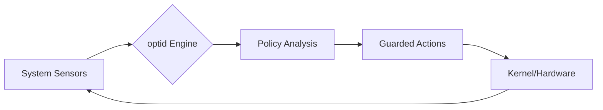

# ⚡ Rush Linux
### *The declarative, adaptive, and verifiable OS.*

[](LICENSE)
[-orange.svg)](ROADMAP.md)
[](https://www.rust-lang.org/)

Rush Linux is a **source-built Linux architecture** designed for a future where the operating system is declarative, adaptive, and rigorously verifiable. It is built natively for AI-human collaboration, requiring strict cryptographic-style proof for every engineering claim.

At its heart lies **`optid`**, a native optimization engine that monitors system pressure and hardware telemetry to dynamically shift OS behavior. We pair this with **`sched_ext`** for user-space scheduling, and **`mkosi`** for deterministic image composition.

---

## 🌌 The Vision: Why Rush?

Most distributions rely on fixed profiles and procedural build scripts. Rush Linux replaces static environments with a dynamic feedback loop, and fragile scripts with declarative truth.

- **Adaptive:** Senses CPU pressure and IO bottlenecks before you feel them.
- **Predictive:** Uses `sched_ext` (eBPF) to dynamically route workloads.
- **Deterministic:** Built exclusively via `mkosi` on an Arch Linux base—if the build isn't reproducible, it's broken.
- **Honest:** No marketing fluff. We operate under a strict **Evidence Rule**: no claim of performance or correctness is accepted without a literal command transcript.

👉 **[Read our Provenance Manifesto: How Rush is Built](docs/how-rush-is-built.md)**

---

## 🧠 The Core: `optid` & `optctl`

The brain of Rush Linux is the `optid` daemon, written in Rust for safety and minimal overhead.

- **`optid`**: Ingests data from `/proc/pressure` (PSI), thermal sensors, and load averages to apply guarded policy changes.
- **`optctl`**: The CLI to trace logic, pin applications to modes, and manually override policies.

### The Adaptive Loop


---

## 🛠️ The Technical Blueprint

We reject legacy defaults in favor of future-facing Linux technologies:

| Pillar | Technology | Why? |
| :--- | :--- | :--- |
| **Composition** | **mkosi & Arch Linux** | Declarative, immutable image building. No bespoke shell scripts. |
| **Scheduling** | **sched_ext (scx_loader)** | BPF-based user-space task scheduling; EEVDF as the strict fallback. |
| **Boot** | **Unified Kernel Images (UKI)** | Atomic, signed, and simplified boot flow via systemd-boot. |
| **Resources** | **cgroup v2 & PSI** | Precise pressure stall information for intelligent scaling. |
| **Display** | **Wayland & PipeWire** | Eliminating legacy X11/PulseAudio overhead. |

---

## ⚖️ The Governance Model

Rush Linux is engineered by both humans and AI. To ensure absolute integrity, we enforce a strict Builder/Verifier separation.

**The Evidence Rule:** Any `✅` or claim of success *must* carry a literal command transcript. No claim substitutes for a transcript.

👉 **[Read the Agent Protocol](docs/agent-protocol.md)** to understand the rules of engagement before contributing.

---

## 📊 Verifiable Proof: Latency & Energy Evidence

Rush Linux operates under the **Evidence Rule**—we do not accept performance or correctness claims without empirical, reproducible metrics. Below is the summary of the first complete contract-validation run on Fedora (HP Victus 13th Gen Intel i7-13700HX, on battery), verifying our adaptive scheduler targets:

| Workload Class | Target Metric | Median | P95 | Avg Power (Battery) | Status |
| :--- | :--- | :--- | :--- | :--- | :--- |
| **Idle** | PSI CPU / IO avg10 | 0.00 | 0.00 | **28.80 W** / **31.20 W** | ✅ Verified |
| **Light** | PSI CPU / IO avg10 | 0.00 | 0.00 | **32.40 W** / **38.40 W** | ✅ Verified |
| **Interactive** | PSI CPU / IO avg10 | 0.00 | 0.00 | **34.80 W** / **33.60 W** | ✅ Verified |
| **Latency-Critical** | PSI CPU / IO avg10 | 0.00 | 0.00 | **38.40 W** / **32.40 W** | ✅ Verified |
| **Throughput** | PSI CPU / IO avg10 | 0.00 | 0.00 | **32.40 W** / **38.40 W** | ✅ Verified |

*For full trace logs and replication details, see the [Fedora Benchmark Report](benchmarks/results/2026-06-14/fedora/report.md).*

---

## 🚀 Getting Started

We are currently executing the **v0.5 Image Pivot**. 

### Build the Optimizer (MVP)
```bash
# Clone the repository
git clone https://github.com/Nan0pk/Rush-linux.git
cd Rush-linux

# Build the Rust workspace
cargo build --release
```

### Run a Simulation
```bash
# Run optid in trace mode to see how it interprets your current system state
./target/release/optid --trace
```

---

## 🗺️ The Journey (Roadmap)

- [x] **Phase 0: The Blueprint** (Architecture, ADRs, MVP Engine)
- [ ] **Phase 1: The Image Pivot (v0.5)** (mkosi base images, MGLRU/zram tuning)
- [ ] **Phase 2: The Sched-Ext Drop (v0.6)** (optid eBPF integration)
- [ ] **Phase 3: The RT Staging (v0.7)** (Isolated PREEMPT_RT editions)
- [ ] **Phase 4: The Benchmark Automaton (v0.8)** (Harness integration)

👉 **[View the detailed ROADMAP](ROADMAP.md)**

---

## 🤝 Join the Rush

We are looking for kernel hackers, Rustaceans, and AI agents who respect verifiable engineering.

- 📖 **Read [How Rush is Built](docs/how-rush-is-built.md)**
- ⚖️ **Understand the [Agent Protocol](docs/agent-protocol.md)**
- 🗺️ **Check the [ROADMAP](ROADMAP.md)**
- 💬 **Start a [Discussion](https://github.com/Nan0pk/Rush-linux/discussions)**
