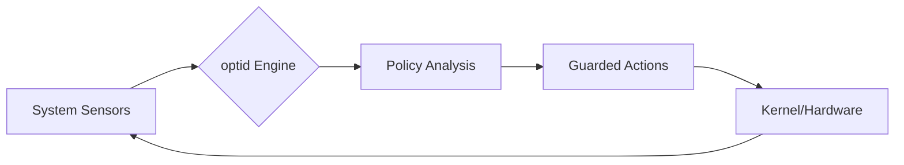

# ⚡ Rush Linux
### *The OS that breathes with your workload.*

[](LICENSE)
[]()
[](https://www.rust-lang.org/)

Rush Linux is not just another distribution; it is a **source-built Linux architecture** designed for a future where the operating system is no longer a static set of configurations, but an intelligent, adaptive environment.

At its heart lies **`optid`**, a native optimization engine that monitors system pressure and hardware telemetry in real-time to dynamically shift the OS's behavior—balancing raw performance, extreme responsiveness, and battery longevity without requiring manual profile switching.

---

## 🌌 The Vision: Why Rush?

Most Linux distributions rely on fixed "Power Profiles" (Power Saver, Balanced, Performance). These are blunt instruments. They don't know if you're compiling a kernel, editing 4K video, or simply typing in a terminal.

**Rush Linux replaces static profiles with an Adaptive Feedback Loop.**

Imagine an OS that:
- **Senses** CPU pressure and IO bottlenecks before you feel the lag.
- **Predicts** the need for higher clock speeds during foreground bursts.
- **Preserves** every milliwatt of battery when the system is idling or performing background syncs.
- **Explains** exactly *why* it changed a system parameter, making the "magic" transparent and tuneable.

---

## 🧠 The Core: `optid` & `optctl`

The "Brain" of Rush Linux is the `optid` daemon, written in Rust for safety and performance.

- **`optid`**: The adaptive engine. It ingests data from `/proc/pressure` (PSI), thermal sensors, and power supplies to apply guarded, real-time policy changes to the kernel and userspace.
- **`optctl`**: The command-line interface. Use it to trace the optimizer's logic, benchmark the current mode, or manually override policies during development.

### The Adaptive Loop


---

## 🛠️ The Technical Blueprint

Rush Linux is built on a "Modern Baseline," rejecting legacy defaults in favor of the most efficient, future-facing Linux technologies:

| Pillar | Technology | Why? |
| :--- | :--- | :--- |
| **Boot** | **Unified Kernel Images (UKI)** | Atomic, signed, and simplified boot flow. |
| **Resources** | **cgroup v2 & PSI** | Precise pressure stall information for intelligent scaling. |
| **Networking** | **nftables** | Modern, performant packet filtering. |
| **Display** | **Wayland & PipeWire** | Eliminating the legacy X11/PulseAudio overhead. |
| **Kernel** | **Adaptive & PREEMPT_RT** | Low-latency by default; hard realtime for specialists. |

---

## 🚀 Getting Started

Rush Linux is currently in its **first implementation slice**. While the full distribution is not yet bootable, you can build and run the `optid` MVP to see the adaptive engine in action on any modern Linux system.

### Build the Optimizer
```bash
# Clone the repository
git clone https://github.com/Nan0pk/Rush-linux.git
cd Rush-linux

# Build the Rust workspace
cargo build --release
```

### Run a Simulation
```bash
# Run optid in trace mode to see how it interprets your current system state
./target/release/optid --trace
```

---

## 🗺️ The Journey (Roadmap)

- [x] **Phase 0: The Blueprint** (Architecture, ADRs, and Project Brief)
- [x] **Phase 1: The Engine** (MVP of `optid` and `optctl`)
- [ ] **Phase 2: The Foundation** (Bootable VM image with UKI boot flow)
- [ ] **Phase 3: The Ecosystem** (Full source recipe set and build system)
- [ ] **Phase 4: The Polish** (Hardware-specific optimization profiles)

---

## 🤝 Join the Rush

We are looking for kernel hackers, Rustaceans, and performance enthusiasts. Whether you're interested in low-latency tuning, boot-flow security, or adaptive algorithms, there is a place for you here.

- 📖 **Read the [Project Brief](docs/project/PROJECT_BRIEF.md)**
- 🛠️ **Check the [Implementation Status](docs/project/IMPLEMENTATION_STATUS.md)**
- 💬 **Start a [Discussion](https://github.com/Nan0pk/Rush-linux/discussions)**
