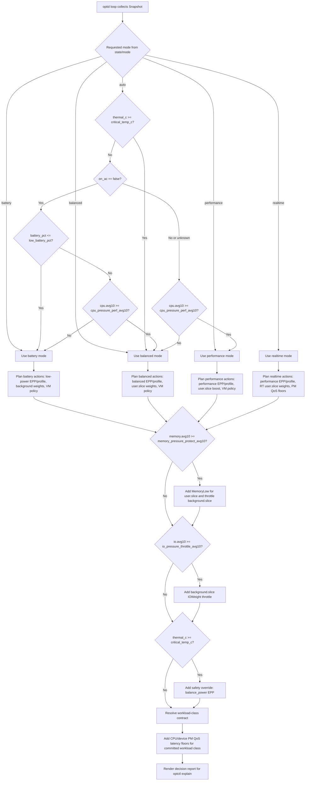

# Adaptive Engine

`optid` is the central feature of Rush Linux. It is a privileged daemon that
observes workload and hardware state, then applies guarded policy changes to
improve responsiveness, battery behavior, thermals, and resource utilization.

## Workload Classification

`optid` implements a workload-class detector (contract-setter) that maps current telemetry and override pins to exactly one of five workload classes:
- `idle`: Extremely low activity.
- `light`: Low background or system activity.
- `interactive`: Default responsive user activity.
- `latency-critical`: High-priority interactive work (e.g., gaming, audio) requiring low latency.
- `throughput`: Massive batch tasks (e.g., compiling) requiring raw compute output.

The classification is performed by a pure function based on load average, PSI pressure, and power supply state, with highest precedence given to explicit application pins (`optctl pin`).

To prevent classification flapping under transient spikes, a hysteresis wrapper filters the decisions, committing changes only when a new workload class persists across a 3-second dwell window.

## Policy Decision Flow

The mode planner is intentionally small and explainable. `Policy::decide()` first resolves the requested mode, then adds actions from the selected mode plus pressure/thermal guardrails. When the requested mode is `auto`, `Policy::auto_mode()` evaluates the live snapshot with this precedence:

All five modes are visible in the flow: `auto` is a resolver, while `battery`, `balanced`, `performance`, and `realtime` are concrete action profiles. Threshold names in the flow correspond directly to `config/optid/policy.toml` and the `Thresholds` struct.

Workload-class selection is separate from mode selection. `Policy::classify()` first honors global and foreground pins, then classifies telemetry into `idle`, `light`, `interactive`, `latency-critical`, or `throughput`. The committed class feeds PM QoS contract selection and is hysteresis-filtered before publication.

## PM QoS and Latency Budget Contracts

`optid` enforces latency budgets defined in `/config/optid/contracts.toml` mapping committed workload classes to concrete latency floors:
- **CPU wakeup latency floor**: Enforced globally by writing the floor in microseconds to `/dev/cpu_dma_latency` using a file descriptor held open for the daemon's lifetime (which automatically releases the floor on crash/exit).
- **Device resume latency floor**: Enforced per-device by writing the floor in microseconds to each PCI device's `/sys/bus/pci/devices/*/power/pm_qos_resume_latency_us` path. Prior sysfs values are journaled to the state directory and reverted on service startup and shutdown.

All PM QoS writes are subject to the dry-run (`--apply`) gate, act on floor changes only to avoid thrashing, and are explainable via `optctl explain`.

## Current MVP

The current Rust implementation:

- reads PSI from `/proc/pressure/{cpu,memory,io}`;
- reads AC/battery state from `/sys/class/power_supply`;
- reads thermal state from `/sys/class/thermal`;
- reads load average from `/proc/loadavg`;
- chooses battery, balanced, performance, or realtime mode;
- workload classifier pure function mapping PSI/load/AC/pin to the five classes with hysteresis, D-Bus override pinning (`optctl pin`), and state publication.
- writes status and decision logs under `/run/optid`;
- applies guarded actions only when `--apply` is passed.

`optctl` communicates with `optid` via D-Bus as defined in `packaging/dbus/io.rushlinux.Optid.xml`, with automatic fallback to files in the state directory if D-Bus is offline.

The packaged default `optid.service` runs in dry-run mode. Mutating policy is
split into `optid-apply.service` so early releases cannot silently change CPU,
platform, or cgroup settings without an explicit service choice.

## Policy Ownership

`optid` is the only default owner of runtime optimization knobs. This avoids
policy fights between power daemons, desktop widgets, shell scripts, and service
drop-ins.

Conflicting services are declared in `packaging/systemd/optid.service` and
`config/optid/policy.toml`.

## Inputs

Accepted input classes:

- PSI for CPU, memory, and I/O pressure.
- Per-cgroup pressure and systemd unit/session metadata.
- AC/battery state, battery percentage, lid/dock state, and suspend signals.
- Thermal zones and platform profile availability.
- CPUFreq, CPPC, Intel/AMD P-state, EPP, turbo state, and CPU topology.
- GPU power state, display mode, fullscreen/VRR state, and dGPU routing.
- Storage class, I/O latency, swap, zswap, and zram activity.
- Foreground app, game, compiler/build, video call, and realtime audio state.
- Optional eBPF probes with explicit overhead limits.

## Actions

Accepted action classes:

- systemd runtime cgroup properties such as CPU weight, I/O weight, memory
  protection, and OOM policy.
- CPU energy performance preference and platform profile changes.
- Background throttling during pressure, heat, video calls, or battery use.
- zswap/zram/swap policy after memory pressure support is implemented.
- GPU, PCIe, USB, NVMe, Wi-Fi, and display power policy only through hardware
  allowlists.

## Guardrails

- Dry-run remains available.
- Every action must have a reason visible through `optctl explain`.
- Hysteresis and cooldowns are required before aggressive policy expansion.
- Unsafe sysfs writes require explicit allowlisting.
- Hardware-specific policy must degrade safely when sensors or firmware knobs
  are missing.
