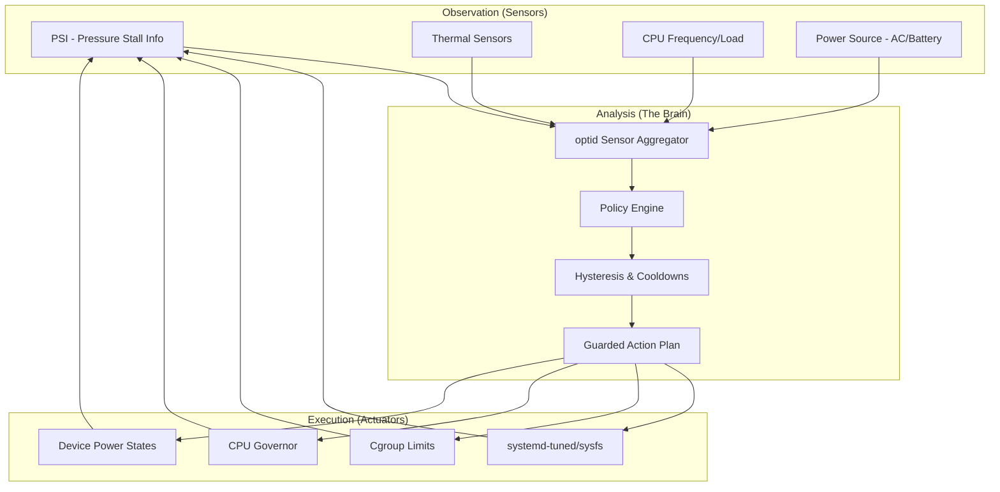

# 🏗️ System Architecture

Rush Linux is designed as a layered stack where each level provides a foundation for the one above it, culminating in a system that is not just stable, but **adaptive**.

## 🧱 The Four Layers of Rush

The architecture is divided into four distinct functional layers:

1. **The Forge (Source Recipes)**: A set of reproducible recipes that produce signed binary packages, ensuring a verifiable chain of trust from source to binary.
2. **The Bedrock (Modern Base OS)**: A future-facing foundation implementing `systemd`, `cgroup v2`, `PSI`, `UKI boot`, `nftables`, `PipeWire`, and `Wayland`, with built-in atomic rollback support.
3. **The Bridge (Hardware Enablement)**: Tailored packages for the Linux kernel, Mesa, firmware, and device-specific policies that translate hardware capabilities into system resources.
4. **The Brain (`optid`)**: The exclusive runtime optimization daemon that orchestrates the behavior of the layers below based on real-time demand.

---

## 🔄 The Adaptive Feedback Loop

Unlike traditional distributions that use static power profiles, Rush Linux employs a continuous feedback loop. `optid` acts as the central controller, ensuring that the system state is always aligned with the current workload.

### System Boundaries
To prevent "policy collision," **`optid` owns the runtime optimization domain.** While other components may provide telemetry or user intent, they are prohibited from independently mutating CPU, power, cgroup, or I/O knobs by default. This ensures a single, explainable source of truth for system behavior.

---

## 🧩 Core Subsystems

Detailed specifications for each subsystem can be found in the following documents:

- **The Adaptive Engine**: Detailed logic of the `optid` loop $
ightarrow$ [adaptive-engine.md](adaptive-engine.md)
- **Kernel Strategy**: Adaptive vs. Realtime configurations $
ightarrow$ [kernel-policy.md](kernel-policy.md)
- **Build Model**: How we transform recipes into a distro $
ightarrow$ [packaging-and-builds.md](packaging-and-builds.md)
- **Boot Flow**: The path from UEFI to UKI $
ightarrow$ [boot-and-updates.md](boot-and-updates.md)
- **Hardware Map**: Supported devices and allowlists $
ightarrow$ [hardware-support.md](hardware-support.md)

---

## ⚖️ Compatibility & Philosophy

### Future-First Positioning
Rush Linux explicitly avoids "legacy by default." We align with the upstream Linux direction. If a technology is deprecated upstream (e.g., X11, sysvinit), it is not included in the base image. Legacy support is provided as optional compatibility packages, ensuring the core remains lean and modern.

### The Documentation Mandate
In Rush Linux, **documentation is code.** 
- A feature is not "implemented" until its architecture is documented.
- A change in behavior is not "complete" until the relevant ADR (Architecture Decision Record) is updated.
- Every policy change must be benchmarked and recorded.
